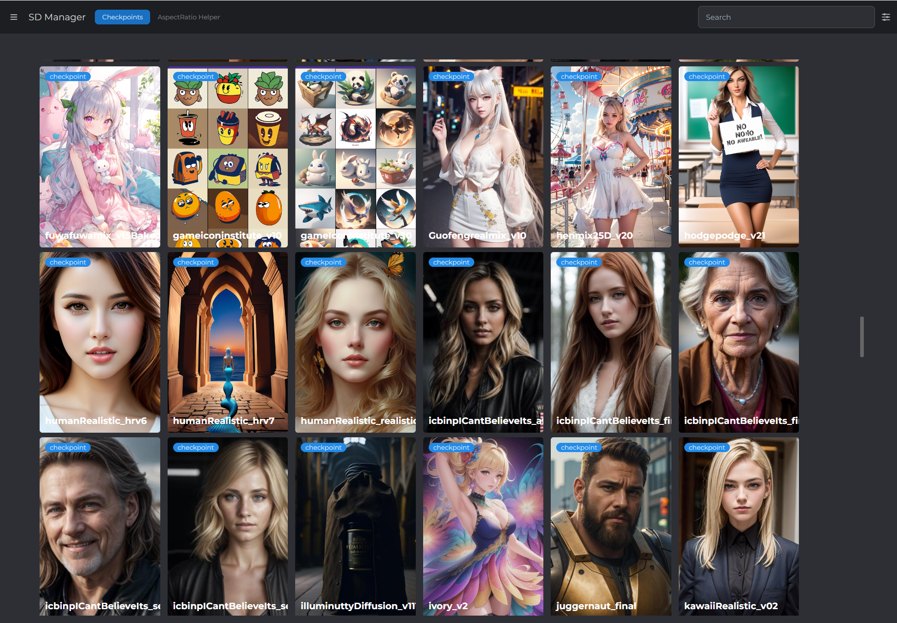
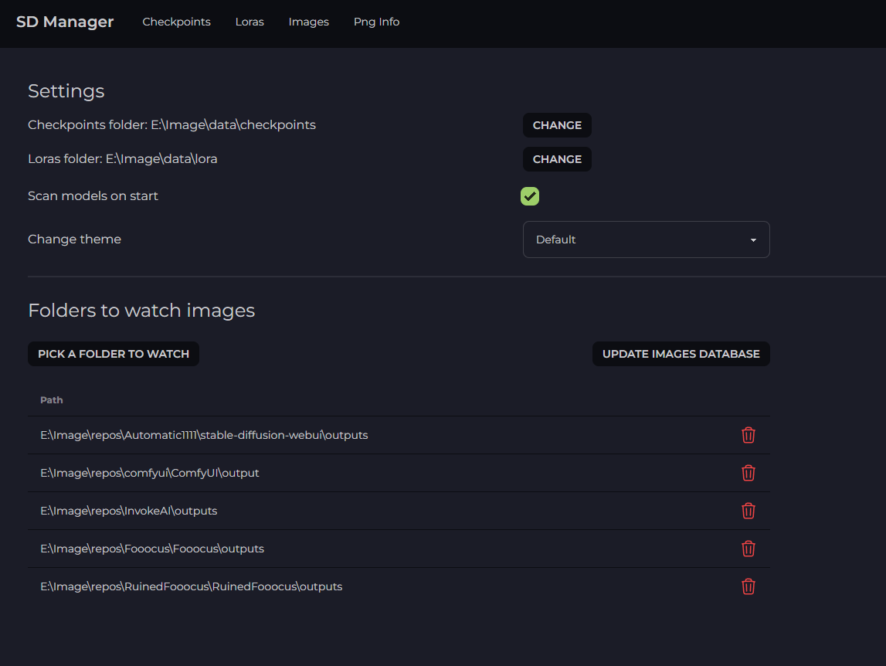

# SD Manager

Sd Manager is a desktop app to organize models and images generated by Automatic1111 or Comfyui

## Features

- Organize and browse images by model
- Rank the images
- Sort the images by rank
- Add notes in markdown
- Insert images in image's notes with markdown
- Check models updates on civitai

# How to use

- set the directory where your stable difussion models are
- add folders to watch for images generated

# Notes

- The database is stored in %AppData%\sd-manager\database.db in case you want to make a backup or edit it

# Run in development mode

- Install node v18
- Install modules with npm install
- Run npm run start
